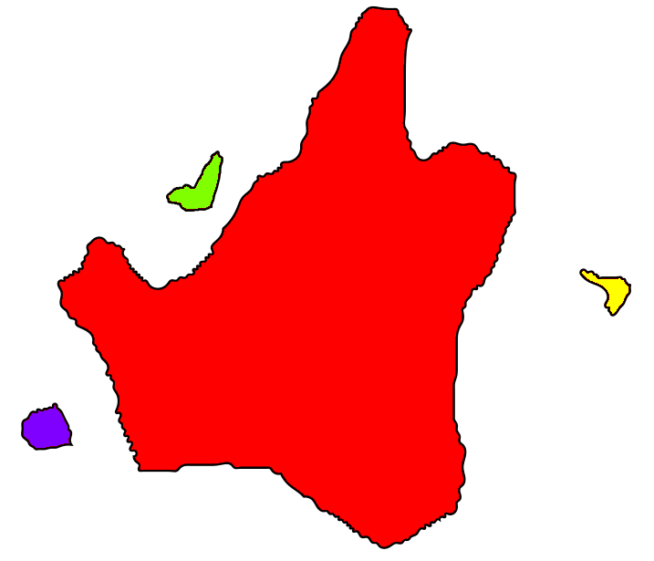
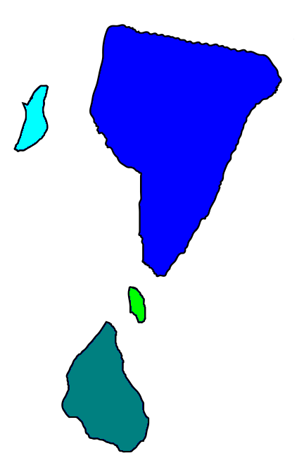
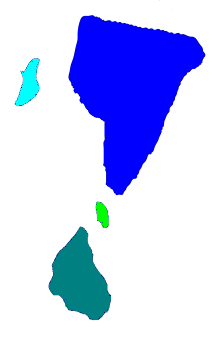
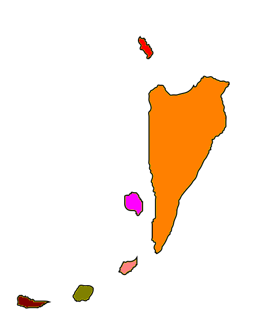
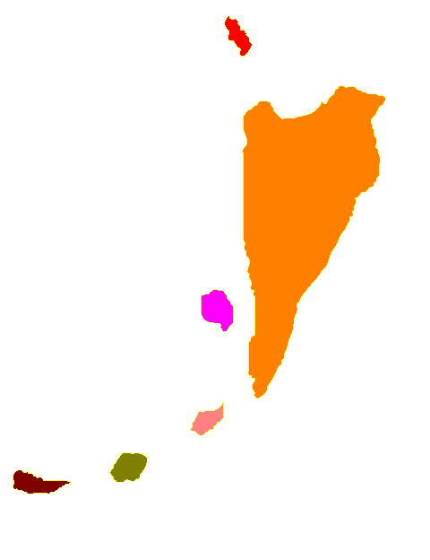

# PMCF

私jekto.vatimelijuがPMCFの地理についてなにも分かっていなかったのでまとめる。

## 基本的情報

> ちなみに割とどうでもいいんですが、現PMCFに当たる諸島は王朝時代は贅品庁であったというのは有名なことだと思いますが、ADLP以降はリナエスト人が多く移住して、リナエスト島（現・マナナ島）と呼ばれていました。
リパラオネ共和国とラネーメ共和国の国土係争地でしたが、後者が共和国革命でアルダーリーパに加わるとこの問題は有耶無耶にされてしまいます。PMCFは（ラネーメ人も含め）全然「父祖伝来」の土地ではないということは注意すべきかなと思われます。 ― Fafs F. Sashimi

jekto.vatimeliju『ということが知られているけど、バート人がamáma bohúの結果pedeに集中したのってなぜなんだろう（元から少数のバート人がいて縁故を頼りにそこに大量にバート人が押し寄せたりしたのか？）』
falira.lyjotafis『なんだろうなあ』

* マナナ島は「アイル共和国に属する島でPMCFの経済の中心」

jekto.vatimeliju『リナエスト・オルス共和国ってどこにあるんですか（素朴な疑問）』  
skarsna haltxeafis nirxavija『[ここ](https://sites.google.com/site/riparaincangku/yuesureone-ren-gong-shi-jie-she-ding/li-shi/philerl/rinaesuto-orusu-gong-he-guo)には"リナエスト本島"とあって、その理解をしていた』  
falira.lyjotafis『内戦期に紙幣から消える島です』   
jekto.vatimeliju『そうよな、えーとそれはつまり』


jekto.vatimeliju『んでアイルがこれ』


falira.lyjotafis『めちゃくちゃややこしいんですが旧リナエスト島とリナエスト本島は違う概念です』  
skarsna haltxeafis nirxavija『うわあ…完全に勘違いしてた。こう考えるとLO本当に小さいなあ…』  
falira.lyjotafis『いにしへの白地図を発掘。下の四島とpede島横の一島を含む領域がリナエスト・オルスかな』

（ここに画像が入る）

jekto.vatimeliju『ふむふむ』


jekto.vatimeliju『とりあえず面積比だけ出しときますかね。文字なし版ないですか（作業がつらい）』  
skarsna.meloviliju『この面積って本当にこの色が塗られているところだけですか？かつての支配地域とか合わせた公称値だったりしない？』  
falira.lyjotafis『大陸に領有を主張していたり描画されてない小さい島がやたら多いとかはあり得る』 
Fafs F. Sashimi『少なくともヴェフィスはリパラオネ共和国の正統後継者を名乗っているけど大陸の領土主張は面積の数値に計上されていない。』

falira.lyjotafis『svgがあるので文字消すか』


falira.lyjotafis『ごく狭い範囲なので緯度差は無視できるかな』  
jekto.vatimeliju『枠線の太さがわりとでかい誤差になるので、あんま気にしなくてよさそう』
falira.lyjotafis『たしかに』

とりあえず[ググって出てきたもの](https://www.imagemagick.org/discourse-server/viewtopic.php?t=16177)を頼りにピクセル数を数える。

jekto.vatimeliju『はい』

```
149710: (128,0,0,255) #800000FF maroon
65693: (0,0,128,255) #000080FF navy
31034: (255,255,0,255) #FFFF00FF yellow
```

jekto.vatimeliju『枠線全部塗りつぶした画像も貰えます？誤差範囲の把握は重要なので』


```
154952: (128,0,0,255) #800000FF maroon
69504: (0,0,128,255) #000080FF navy
34226: (255,255,0,255) #FFFF00FF yellow
```

falira.lyjotafis『雑に見積もって5:2:1くらいか』  
jekto.vatimeliju『9:4:2が誤差の範囲内に収まるっぽい。16906ピクセルを1とすると9:4:2が誤差の範囲内』

## 島の面積測るよ

16906ピクセルを「半LO」として島を測ると捗りそう。

jekto.vatimeliju『とりあえずシーレーオー（xi -r- LO）単位で各島の面積を求めとくか』

共和国ずつで処理するか。ということで分割する。

### アイル共和国




えーmanmanaを赤、pedeを黄、aikitを緑、atalamを紫に塗った状態にした。

borderedはこのようである。

```
      1664: (128,0,255,255) #8000FFFF srgba(128,0,255,1)
      1432: (128,255,0,255) #80FF00FF srgba(128,255,0,1)
    145806: (255,0,0,255) #FF0000FF red
       808: (255,255,0,255) #FFFF00FF yellow
```

1664+1432+145806+808 は 149710 であるので問題ない。

nonborderedはこのようである。

```
        32: (128,0,0,255) #800000FF maroon
      1996: (128,0,255,255) #8000FFFF srgba(128,0,255,1)
      1830: (128,255,0,255) #80FF00FF srgba(128,255,0,1)
    149943: (255,0,0,255) #FF0000FF red
      1151: (255,255,0,255) #FFFF00FF yellow
```

32+1996+1830+149943+1151 は 154952 であるので問題ない。32ピクセルほど塗り残したmaroonがあるということになるが、微小なので当然無視してよい。

ということで、

| 島名 | ピクセル数 | xirleror
|------|-----------|----------| 
| manmana | 145806 ~ 149943 | 8.624 ~ 8.870
| pede | 808 ~ 1151 | 0.048 ~ 0.068
| atalam | 1664 ~ 1996 | 0.098 ~ 0.118
| aikit | 1432 ~ 1830 | 0.085 ~ 0.108 
| (三島合計) | 3904 ~ 4977 | 0.231 ~ 0.294

やっぱりマナナ島でかいんだよな。

### ヴェフィス共和国




えーと青がkawakija / [kaka](https://sites.google.com/site/riparaincangku/yuesureone-ren-gong-shi-jie-she-ding/li-shi/philerl/cv)、tealがpokjut、cyanが多分[タムシエルミワ](https://sites.google.com/site/riparaincangku/yuesureone-ren-gong-shi-jie-she-ding/li-shi/philerl/cv#TOC--20)で緑が「「「小島」」」。

borderedはこのようである。

```
     50768: (0,0,255,255) #0000FFFF blue
     12303: (0,128,128,255) #008080FF teal
       640: (0,255,0,255) #00FF00FF lime
      1982: (0,255,255,255) #00FFFFFF cyan
```

50768+12303+640+1982 は 65693 であるので問題ない。

nonborderedはこのようである。

```
        18: (0,0,128,255) #000080FF navy
     52857: (0,0,255,255) #0000FFFF blue
     13272: (0,128,128,255) #008080FF teal
       895: (0,255,0,255) #00FF00FF lime
      2462: (0,255,255,255) #00FFFFFF cyan
```

18+52857+13272+895+2462 は 69504 であるので問題ない。

ということで、

| 島名 | ピクセル数 | xirleror
|------|-----------|----------| 
| kawakija / kaka | 50768 ~ 52857 | 3.003 ~ 3.127
| pokjut | 12303 ~ 13272 | 0.728 ~ 0.785
| タムシエルミワ | 1982 ~ 2462 | 0.117 ~ 0.146
| 「「「小島」」」 | 640 ~ 895 | 0.038 ~ 0.053

### リナエスト・オルス連合共和国



